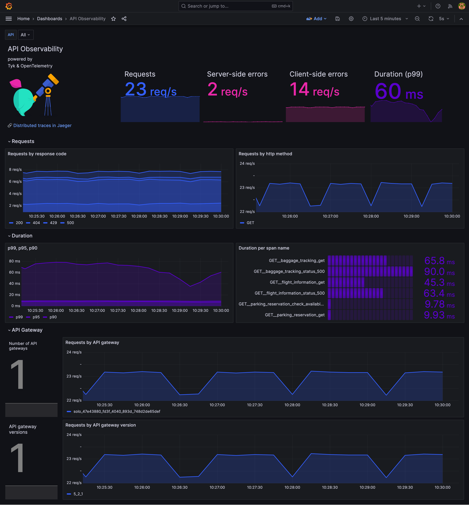

# API Observability with OpenTelemetry

## About

This is a demo project running on Docker, that shows how to configure Tyk Gateway OSS, OpenTelemetry Collector, Jaeger, Prometheus and Grafana OSS to set-up an API observability dashboard for your APIs managed by Tyk.



## Deploy and run the demo

1. Clone this repository:

```
git clone https://github.com/TykTechnologies/demo-api-observability-opentelemetry.git
```

2. Start the services

```
cd ./demo-api-observability-opentelemetry/
docker compose up -d
```

3. Verify that all services are running

- Tyk Gateway - health check runs on [http://localhost:8080/hello](http://localhost:8080/hello)
- Jaeger runs on [http://localhost:16686/](http://localhost:16686/)
- Prometheus runs on [http://localhost:9090/](http://localhost:9090/)
- Grafana OSS runs on [http://localhost:3000/](http://localhost:3000/)
    - The default log-in at start is admin/admin, once logged in you will be prompted for a new password

4. Generate traffic

[K6](https://k6.io/) is used to generate traffic to the API endpoints. The load script [load.js](./deployments/k6/load.js) will run for 15 minutes.

```
docker compose run  k6 run /scripts/load.js
```

5. Check out the dashboard in Grafana

Go to [Grafana](http://localhost:3000/) in your browser (initial user/pwd: admin/admin) and open the dashboard called [*API Observability*](./deployments/grafana/provisioning/dashboards/API-observability.json).


The dashboard aggregates the data for all the APIs. You can use the following dropdown to filter per API:


6. Explore traces in Jaeger

Go to [Jaeger](http://localhost:16686/) in your browser to explore the traces generated by Tyk.


## Tear down

Stop the services

```
docker compose stop
```

Remove the services

```
docker compose down
```

## How does it work?

Configuration:

* Tyk API Gateway
  * is configured per environment variables in the [Docker compose file](./docker-compose.yml) to export the OpenTelemetry spans to the OpenTelemetry Collector:
```
        - TYK_GW_OPENTELEMETRY_ENABLED=true
        - TYK_GW_OPENTELEMETRY_EXPORTER=grpc
        - TYK_GW_OPENTELEMETRY_ENDPOINT=otel-collector:4317
```
  * is configured to load the API definitions from the ([apps Folder](./deployments/tyk-gateway/apps/))
* K6 will use the load script [load.js](./deployments/k6/load.js) to generate demo traffic to the API endpoints
* OpenTelemetry Collector
    * is configured to export spans to Jaeger
    * is configured create metrics from spans using the SpanMetrics Connector and expose them as Prometheus metrics on a Collector endpoint
    * visual configuration of the pipeline generated by [OTelBin](https://www.otelbin.io/) (see [Collector config yaml](./deployments/otel-collector/otel-collector.yml)):
    
* Prometheus
  * [prometheus.yml](./deployments/prometheus/prometheus.yml) is configured to automatically scrape the endpoint exposed by the OpenTelemetry Collector
* Grafana
  * [prometheus_ds.yml](./deployments/grafana/provisioning/datasources/prometheus_ds.yml) is configured to connect Grafana automatically to Prometheus
  * [API-observability.json](./deployments/grafana/provisioning/dashboards/API-observability.json) is the dashboard definition


## Contribute

You are welcome to contribute by 
* asking questions / suggesting improvment / reporting issues in this [GitHub project](https://github.com/TykTechnologies/demo-api-observability-opentelemetry/issues) or in the [Tyk Community forum](https://community.tyk.io)
* making pull request, see the [contributing guide](./CONTRIBUTING.md)


## Support, questions & feedback

This is a demo project, using [Tyk Gateway](https://github.com/TykTechnologies/tyk).

For question about our products, please use [Tyk Community forum](https://community.tyk.io/).
<br />Clients can also use support@tyk.io.
<br />Potential clients and evaluators, please use info@tyk.io.
